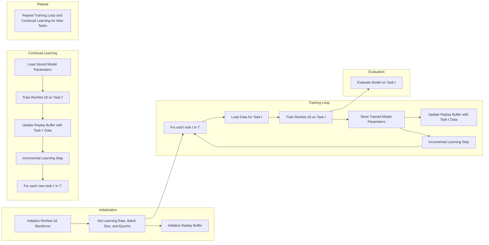

# Continual Learning ML Research
Updates and Version control for my models and code

```mermaid
graph LR

subgraph Initialization
    A[Initialize ResNet-18 Backbone]
    B[Set Learning Rate, Batch Size, and Epochs]
    C[Initialize Replay Buffer]
end

subgraph Training Loop
    D[For each task t in T]
    E[Load Data for Task t]
    F[Train ResNet-18 on Task t]
    G[Store Trained Model Parameters]
    H[Update Replay Buffer with Task t Data]
    I[Incremental Learning Step]
end

subgraph Evaluation
    J[Evaluate Model on Task t]
end

subgraph Continual Learning
    K[For each new task t' in T']
    L[Load Stored Model Parameters]
    M[Train ResNet-18 on Task t']
    N[Update Replay Buffer with Task t' Data]
    O[Incremental Learning Step]
end

subgraph Repeat
    P[Repeat Training Loop and Continual Learning for New Tasks]
end

A --> B
B --> C
B --> D
D --> E
E --> F
F --> G
G --> H
G --> I
I --> D
F --> J
L --> M
M --> N
N --> O
O --> K

```
